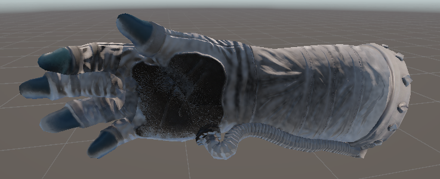
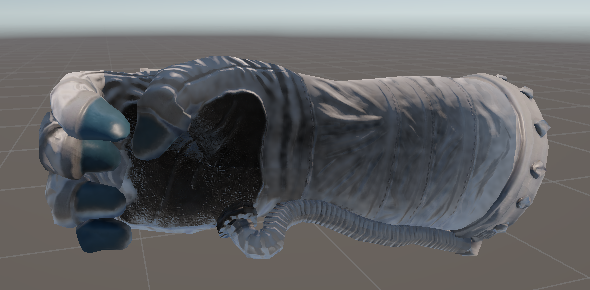
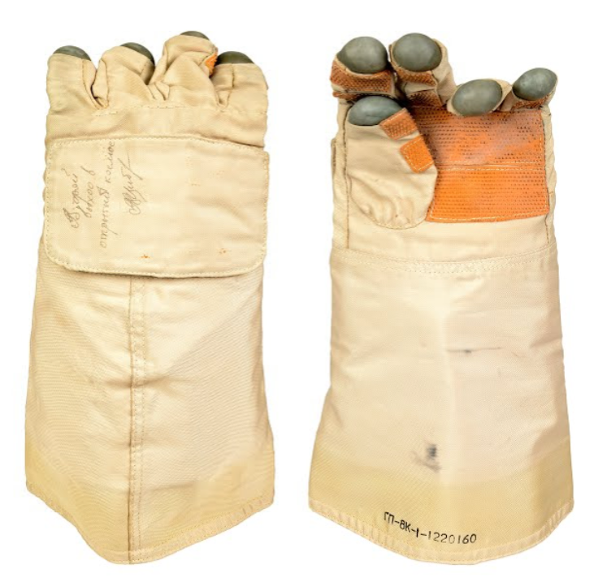
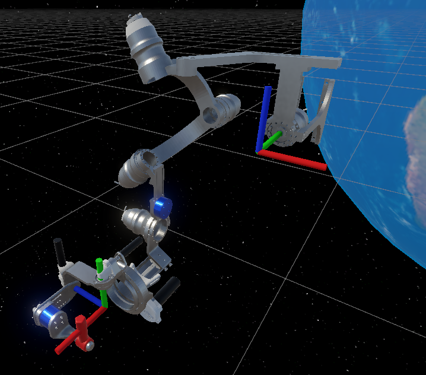
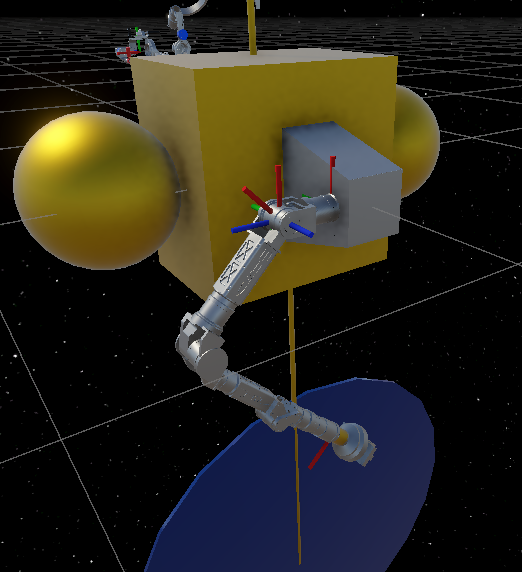
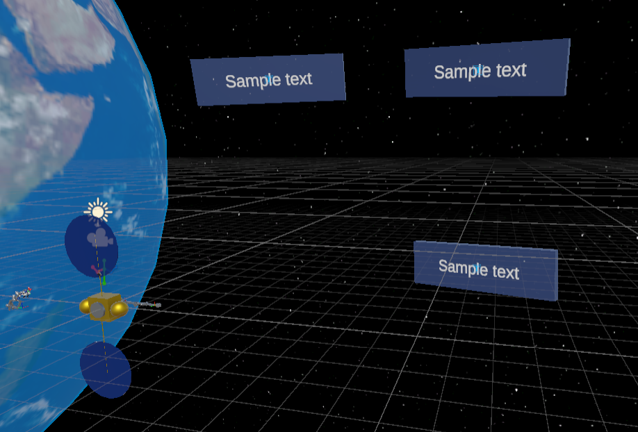
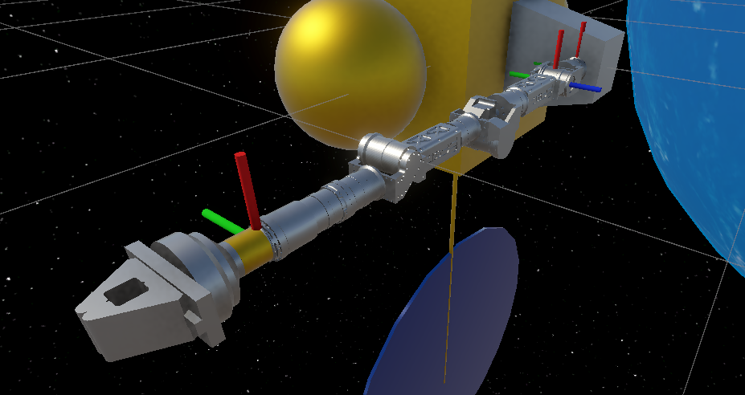
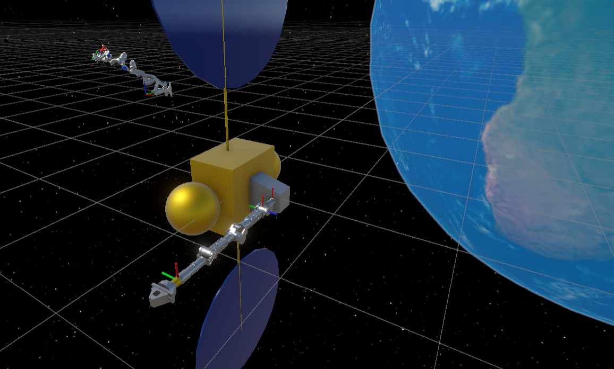

### *Development of the Extended Reality (XR) Interface For*
# **MITS: Maryland Immersive Telepresence System**
Final Project Report for CMSC731 - Advances in XR

## FINAL PRESENTATION
You can find the final presentation here:
https://docs.google.com/presentation/d/1wnVwsewZptVc61APMiV7Pq-s1Am0IXoCEE0MnH264mo/edit?usp=sharing

## 4/30 PROGRESS REPORT
You can find the 4/30 progress report here:
https://docs.google.com/presentation/d/1GbH34nYDGVq1rYPkOViydhGDx8m5ceYtm0VdYqQMS0Y/edit?usp=sharing

## Github Repo
You can find the relevant Github Repo with the source code here:
https://github.com/RomePerl14/CMSC731

## OVERVIEW
This webpage contains the details of my final project submission for CMSC731 - Advances in XR, where I worked on developing the extended reality interface portion MITS. There are three main features that were investigated and developed during the course of this final project:
- *Controlling simulated robots using the Maryland-Georgetown-Army Exoskeleton (MGAXOS)*
- *Simulating robots in Unity and interacting with them physically*
- *Being able to command and collect joint telemetry from simulated robots*

All of this had to also be integrated within an extended reality application, and couldn't just be a 3D development environment. This required me to relearn all of Unity's XR Interaction Toolkit (as it has changed drastically since 2022) and figure out how to best communicate with the robot structures provided by the Unity Robotics hub. While I had worked with the Unity Robotics hub in the past, I was never able to dig deep and look into the underlying structure and functionality that it provided, so this was a great change for me to do that. While I did not get as much as I would have liked done, I not only learned a lot about Unity and the XR Interaction Toolkit, but I for the first time I was able to sample what a full MITS concept should be like - XR and exoskeleton interaction. The work done for this project provides a very promising headstart for future development of MITS and XR robot interaction

## DEMO VIDEOS:
### COMMANDING A VIRTUAL ROBOT WITH MITS [DIRECT MAPPING]
<iframe width="560" height="315" src="https://www.youtube.com/embed/gYDaVtuCVa0?si=7lUpatdBVAKn3Uca" title="YouTube video player" frameborder="0" allow="accelerometer; autoplay; clipboard-write; encrypted-media; gyroscope; picture-in-picture; web-share" referrerpolicy="strict-origin-when-cross-origin" allowfullscreen></iframe>

### COMMANDING A VIRTUAL ROBOT WITH MITS [DELTA COMMANDS]
<iframe width="560" height="315" src="https://www.youtube.com/embed/0H674Lqk_BY?si=VevjEPLlCm3ujYAd" title="YouTube video player" frameborder="0" allow="accelerometer; autoplay; clipboard-write; encrypted-media; gyroscope; picture-in-picture; web-share" referrerpolicy="strict-origin-when-cross-origin" allowfullscreen></iframe>

### GENERATING TRAJECTORIES USING VR INTERACTION
<iframe width="560" height="315" src="https://www.youtube.com/embed/z0G3piYmYuw?si=J7G9rsrq7CzbfCqI" title="YouTube video player" frameborder="0" allow="accelerometer; autoplay; clipboard-write; encrypted-media; gyroscope; picture-in-picture; web-share" referrerpolicy="strict-origin-when-cross-origin" allowfullscreen></iframe>

### ROBOT FREAKOUT [Common Issue when using Unity IK and Inv Dyn solvers]
<iframe width="560" height="315" src="https://www.youtube.com/embed/23y1Pqes5Dg?si=a9lSi7xfRH8CVGXk" title="YouTube video player" frameborder="0" allow="accelerometer; autoplay; clipboard-write; encrypted-media; gyroscope; picture-in-picture; web-share" referrerpolicy="strict-origin-when-cross-origin" allowfullscreen></iframe>

## Project Dependencies
To run any of the scenes in this project, you must install the following packages:
- Pacakges provided directly by Unity:
    - XR Interaction Toolkit
    - XR Plugin Management
    - Universal Render Pipeline
    - XR Core Utilities (probably, might be unused)
    - OpenXR Plugin
- Packages which are provided by Unity but must be acquired via Git:
    - Unity Robotics Hub ROS-TCP-Connector: https://github.com/Unity-Technologies/ROS-TCP-Connector.git?path=/com.unity.robotics.ros-tcp-connector
    - Unity Robotics Hub Visualization Tools: https://github.com/Unity-Technologies/ROS-TCP-Connector.git?path=/com.unity.robotics.visualizations
    - Unity Robotics Hub ROS-TCP-Endpoint: https://github.com/Unity-Technologies/ROS-TCP-Endpoint.git
    - Unity Robotics Hub URDF Importer: https://github.com/Unity-Technologies/URDF-Importer.git?path=/com.unity.robotics.urdf-importer

## Affiliation Statement
Much of this project is affiliated with my work at the University of Maryland Space Systems Laboratory (UMD SSL). However, this project does not use SSL generated code, it's actually the opposite. Much of the code has labels bearing SSL; this is because I wanted to use the work from this project *in the future* (actually this upcoming summer) to continue working on MITS, and rather than having to sort through a bunch of resources, all of the code written for this project was written with the intent of using it to continue MITS development at the SSL, and seemless integrate with the SSL's core robot software stack. MonoBehavior Scripts (as well as some custom libraries) were all written for MTIS and are intended to continued to be used after this final project!!

That being said, there are several assets which come directly from prior SSL development. Mainly, the robot models and Universal Robot Description Format (URDF) files, which are used by the Unity Robotics hub URDF important to autonomatically generate ArticulationBody trees, are from prior SSL work. However, I did write the URDF files, I just didn't make the CAD :P (and thanks to those who did, Nic and Charlie (For DymaFlight, the manipulator) And Stephen Rodrick and Thomas Something and the vast number of people who worked on MGAXOS!)

## Project Structure
Within the *Assets* folder, you'll find the following structure:
- Materials
- Prefabs
- Scenes
- Scripts
- Ssl Messages
- Ssl Robots
- Ssl Robots Prefabs

**ANY OTHER FOLDERS ARE GENERATED BY PACKAGES, AND WERE NOT DIRECTLY MADE BY ME!**

### Materials
This folder is pretty standard, it contains the material objects for the materials used in the project, nice and neatly organized (and labeled!)

### Prefabs
This contains both custom prefabs and downloaded prefabs, but in general any Prefab used by the project should be stored in here, UNLESS it is a robot prefab (see below). By prefabs, I mean the entire shebang of stuff you might get when downloading a model - for instance, the `Oculus Hands` folder contains animations, the models of the hands, the prefabs themselves, etc etc. If a model is downloaded from the internet, whatever it comes with is neatly stored in this folder.

#### Astronaut hands
A brief mention of the astornaut hands prefab as I am very proud of my work on animating them. I ALSO successfully applied the provided normal map to their texture, which really made them pop (I'm sure a very trival thing but I am proud of myself nonetheless)! A small detail you may or may not notice is that the astronaut "close" animation does not form a fist like normal close or fist animations do. This is because astronauts *struggle* to fully close their hands while wearing spacesuit gloves, as there is typically no dedicated metacarpophalangeal joint (knuckles) in spacesuit gloves. See the image below:

 

### Scenes
This folder contains seperate scenes for organizing demos - there is one scene for demo-ing the MGAXOS control, and one scene to demonstrate trajectory generation, and another scene that is kinda empty... it was meant for physically driving the robot by interacting with it

### Scripts
This folder is dense - it contains all the scripts used (and some unused) by the project. This project contains all of the scripts made for HWs 1-4, so some of them are unused as I defaulted to the XR Interaction Toolkit provided plugins.

- ssl_scripts <-- contains 3D, non-XR dependent scripts
    - locomotion <-- contains 3D locomotion scripts
    - object_behavior <-- contains scripts that modify object behavior
    - physical_buttons <-- contains scripts used for physical buttons (like from HW2)
    - ssl_articulationbody_interface <-- the meatiest folder, contains the two major classes that allow us to communicate with simulated robots seemlessly
    - ssl_common_types <-- contains commonly used data structures and variables, and stuff
    - ssl_controllers <-- contains control scripts, mainly for simulated robots (they read/write and perform actions on simulated robots)
- ssl_xr_scripts <-- contain XR dependent scripts
    - ssl_interactions <-- scripts used for XR interactions
    - ssl_locomotion <-- scripts used for XR locomotion, written by muah (for HW4)
    - ssl_tests <-- test folder for temp scripts
    - ssl_xr_hand_control <-- contain scripts that revolve XR hand control, such as getting inputs, animating movements, etc
    - ssl_xr_managers <-- scripts that act as managers between several components in a XR scene, like the hands, robots, UI elements, etc

### Ssl Messages
This folder has the Unity-Robotics-Hub-Generated data structures that convert ROS/ROS 2 based messages and services into an object usable by Unity. While the Unity Robotics Hub provides ROS/ROS2 based messages/services out-of-the-box, this folder specifically contains any SSL written messages/services to allow us to more seamlessly interact with the robot control software

### Ssl Robots
This folder contains the URDF and .obj meshes for several SSL robots (all designed for space applications), as well as some end-effectors that I made previously.

### Ssl Robots Prefabs
Because you need to re-generate a simulated robot every time you open a new scene, or forget to copy the GameObject, or make a new project, it can become annoying. As well, there are initial tweaks that must happen on first generation (the first link, the base, is missing an articulationbody always, so you must manually add one, and you must delete the extra scripts provided upon generation). This folder contains prefabs that have already been conditioned for SSL (and this project's) use cases.

## VR Scene Setup
TODO, eventually

## Rig Animation Overview
TODO, eventually

## Screenshots

 

