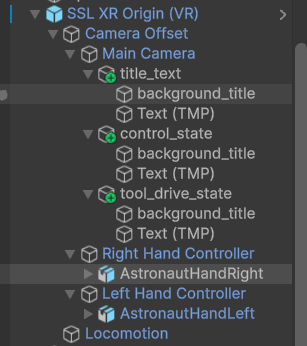
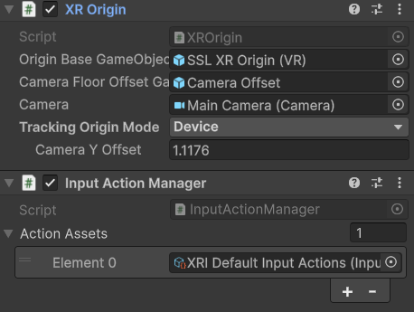
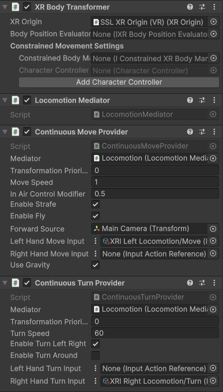
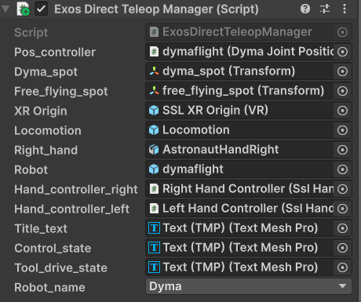

### *Development of the Extended Reality (XR) Interface For*
# **MITS: Maryland Immersive Telepresence System**
Final Project Report for CMSC731 - Advances in XR

## FINAL PRESENTATION
You can find the final presentation here:
https://docs.google.com/presentation/d/1wnVwsewZptVc61APMiV7Pq-s1Am0IXoCEE0MnH264mo/edit?usp=sharing

## 4/30 PROGRESS REPORT
You can find the 4/30 progress report here:
https://docs.google.com/presentation/d/1GbH34nYDGVq1rYPkOViydhGDx8m5ceYtm0VdYqQMS0Y/edit?usp=sharing

## Github Repo
You can find the relevant Github Repo with the source code here:
https://github.com/RomePerl14/CMSC731

## OVERVIEW
This webpage contains the details of my final project submission for CMSC731 - Advances in XR, where I worked on developing the extended reality interface portion MITS. There are three main features that were investigated and developed during the course of this final project:
- *Controlling simulated robots using the Maryland-Georgetown-Army Exoskeleton (MGAXOS)*
- *Simulating robots in Unity and interacting with them physically*
- *Being able to command and collect joint telemetry from simulated robots*

All of this had to also be integrated within an extended reality application, and couldn't just be a 3D development environment. This required me to relearn all of Unity's XR Interaction Toolkit (as it has changed drastically since 2022) and figure out how to best communicate with the robot structures provided by the Unity Robotics hub. While I had worked with the Unity Robotics hub in the past, I was never able to dig deep and look into the underlying structure and functionality that it provided, so this was a great change for me to do that. While I did not get as much as I would have liked done, I not only learned a lot about Unity and the XR Interaction Toolkit, but I for the first time I was able to sample what a full MITS concept should be like - XR and exoskeleton interaction. The work done for this project provides a very promising headstart for future development of MITS and XR robot interaction.

## DEMO VIDEOS:
### COMMANDING A VIRTUAL ROBOT WITH MITS [DIRECT MAPPING]
<iframe width="560" height="315" src="https://www.youtube.com/embed/gYDaVtuCVa0?si=7lUpatdBVAKn3Uca" title="YouTube video player" frameborder="0" allow="accelerometer; autoplay; clipboard-write; encrypted-media; gyroscope; picture-in-picture; web-share" referrerpolicy="strict-origin-when-cross-origin" allowfullscreen></iframe>

### COMMANDING A VIRTUAL ROBOT WITH MITS [DELTA COMMANDS]
<iframe width="560" height="315" src="https://www.youtube.com/embed/0H674Lqk_BY?si=VevjEPLlCm3ujYAd" title="YouTube video player" frameborder="0" allow="accelerometer; autoplay; clipboard-write; encrypted-media; gyroscope; picture-in-picture; web-share" referrerpolicy="strict-origin-when-cross-origin" allowfullscreen></iframe>

### GENERATING TRAJECTORIES USING VR INTERACTION
<iframe width="560" height="315" src="https://www.youtube.com/embed/z0G3piYmYuw?si=J7G9rsrq7CzbfCqI" title="YouTube video player" frameborder="0" allow="accelerometer; autoplay; clipboard-write; encrypted-media; gyroscope; picture-in-picture; web-share" referrerpolicy="strict-origin-when-cross-origin" allowfullscreen></iframe>

### ROBOT FREAKOUT [Common Issue when using Unity IK and Inv Dyn solvers]
<iframe width="560" height="315" src="https://www.youtube.com/embed/23y1Pqes5Dg?si=a9lSi7xfRH8CVGXk" title="YouTube video player" frameborder="0" allow="accelerometer; autoplay; clipboard-write; encrypted-media; gyroscope; picture-in-picture; web-share" referrerpolicy="strict-origin-when-cross-origin" allowfullscreen></iframe>

## Project Dependencies
To run any of the scenes in this project, you must install the following packages:
- Pacakges provided directly by Unity:
    - XR Interaction Toolkit
    - XR Plugin Management
    - Universal Render Pipeline
    - XR Core Utilities (probably, might be unused)
    - OpenXR Plugin
- Packages which are provided by Unity but must be acquired via Git:
    - Unity Robotics Hub ROS-TCP-Connector: https://github.com/Unity-Technologies/ROS-TCP-Connector.git?path=/com.unity.robotics.ros-tcp-connector
    - Unity Robotics Hub Visualization Tools: https://github.com/Unity-Technologies/ROS-TCP-Connector.git?path=/com.unity.robotics.visualizations
    - Unity Robotics Hub ROS-TCP-Endpoint: https://github.com/Unity-Technologies/ROS-TCP-Endpoint.git
    - Unity Robotics Hub URDF Importer: https://github.com/Unity-Technologies/URDF-Importer.git?path=/com.unity.robotics.urdf-importer

## Affiliation Statement
Much of this project is affiliated with my work at the University of Maryland Space Systems Laboratory (UMD SSL). However, this project does not use SSL generated code, it's actually the opposite. Much of the code has labels bearing SSL; this is because I wanted to use the work from this project *in the future* (actually this upcoming summer) to continue working on MITS, and rather than having to sort through a bunch of resources, all of the code written for this project was written with the intent of using it to continue MITS development at the SSL, and seemless integrate with the SSL's core robot software stack. MonoBehavior Scripts (as well as some custom libraries) were all written for MTIS and are intended to continued to be used after this final project!!

That being said, there are several assets which come directly from prior SSL development. Mainly, the robot models and Universal Robot Description Format (URDF) files, which are used by the Unity Robotics hub URDF important to autonomatically generate ArticulationBody trees, are from prior SSL work. However, I did write the URDF files, I just didn't make the CAD :P (and thanks to those who did, Nic and Charlie (For DymaFlight, the manipulator) And Stephen Rodrick and Thomas Something and the vast number of people who worked on MGAXOS!).

## Project Structure
Within the *Assets* folder, you'll find the following structure:
- Materials
- Prefabs
- Scenes
- Scripts
- Ssl Messages
- Ssl Robots
- Ssl Robots Prefabs

**ANY OTHER FOLDERS ARE GENERATED BY PACKAGES, AND WERE NOT DIRECTLY MADE BY ME!**

### Materials
This folder is pretty standard, it contains the material objects for the materials used in the project, nice and neatly organized (and labeled!).

### Prefabs
This contains both custom prefabs and downloaded prefabs, but in general any Prefab used by the project should be stored in here, UNLESS it is a robot prefab (see below). By prefabs, I mean the entire shebang of stuff you might get when downloading a model - for instance, the `Oculus Hands` folder contains animations, the models of the hands, the prefabs themselves, etc etc. If a model is downloaded from the internet, whatever it comes with is neatly stored in this folder.

#### Astronaut hands
A brief mention of the astornaut hands prefab as I am very proud of my work on animating them. I ALSO successfully applied the provided normal map to their texture, which really made them pop (I'm sure a very trival thing but I am proud of myself nonetheless)! A small detail you may or may not notice is that the astronaut "close" animation does not form a fist like normal close or fist animations do. This is because astronauts *struggle* to fully close their hands while wearing spacesuit gloves, as there is typically no dedicated metacarpophalangeal joint (knuckles) in spacesuit gloves. See the image below:

 

### Scenes
This folder contains seperate scenes for organizing demos - there is one scene for demo-ing the MGAXOS control, and one scene to demonstrate trajectory generation, and another scene that is kinda empty... it was meant for physically driving the robot by interacting with it.

### Scripts
This folder is dense - it contains all the scripts used (and some unused) by the project. This project contains all of the scripts made for HWs 1-4, so some of them are unused as I defaulted to the XR Interaction Toolkit provided plugins.

- ssl_scripts <-- contains 3D, non-XR dependent scripts
    - locomotion <-- contains 3D locomotion scripts
    - object_behavior <-- contains scripts that modify object behavior
    - physical_buttons <-- contains scripts used for physical buttons (like from HW2)
    - ssl_articulationbody_interface <-- the meatiest folder, contains the two major classes that allow us to communicate with simulated robots seemlessly
    - ssl_common_types <-- contains commonly used data structures and variables, and stuff
    - ssl_controllers <-- contains control scripts, mainly for simulated robots (they read/write and perform actions on simulated robots)
- ssl_xr_scripts <-- contain XR dependent scripts
    - ssl_interactions <-- scripts used for XR interactions
    - ssl_locomotion <-- scripts used for XR locomotion, written by muah (for HW4)
    - ssl_tests <-- test folder for temp scripts
    - ssl_xr_hand_control <-- contain scripts that revolve XR hand control, such as getting inputs, animating movements, etc
    - ssl_xr_managers <-- scripts that act as managers between several components in a XR scene, like the hands, robots, UI elements, etc

### Ssl Messages
This folder has the Unity-Robotics-Hub-Generated data structures that convert ROS/ROS 2 based messages and services into an object usable by Unity. While the Unity Robotics Hub provides ROS/ROS2 based messages/services out-of-the-box, this folder specifically contains any SSL written messages/services to allow us to more seamlessly interact with the robot control software.

### Ssl Robots
This folder contains the URDF and .obj meshes for several SSL robots (all designed for space applications), as well as some end-effectors that I made previously.

### Ssl Robots Prefabs
Because you need to re-generate a simulated robot every time you open a new scene, or forget to copy the GameObject, or make a new project, it can become annoying. As well, there are initial tweaks that must happen on first generation (the first link, the base, is missing an articulationbody always, so you must manually add one, and you must delete the extra scripts provided upon generation). This folder contains prefabs that have already been conditioned for SSL (and this project's) use cases.

# PROJECT USAGE
Running the demos in the project is straight forward, in the sense that you should be able to download the git repository and open up the project without needing to do anything additional. With that being said, this section will go over several critical scripts and their usage during runtime

## COMMON USAGE SCRIPTS/COMPONENTS
This section will cover scripts/components that are used in both the teleoperation demo, and the trajectory generation demo! Details about specific components for each demo will be discussed in their own section (see below).

### SSL XR Origin (VR)
This prefab is an extension of the generic Unity XR Origin, that incorporates locomotion and hand tracking. The unique components are shown in the below GameObject Tree:

There are two components on the parent GameObject of `SSL XR Origin (VR)` that are shared between each demo:
- XR Origin (*FROM UNITY*) - The origin of the XR Controller, parent frame of the headset and controllers [link: https://docs.unity3d.com/6000.4/Documentation/Manual/xr-origin.html]
- Input Action Manager (*FROM UNITY*) - Manages the inputs and actions of the XR setup: headsets and controllers [link: https://docs.unity3d.com/Packages/com.unity.xr.interaction.toolkit@3.0/manual/input-action-manager.html]

Below is the settings for each component:

#### Hand Controller and Astronaut Hand
The Right Hand Controller and Left Hand Controller are functionally identical, the only difference is that the model for the Right Hand Controller is mirrored to convert it from a left hand model to a right hand model. The `Right/Left Hand Controller` GameObject has the following:
- Tracked Pose Driver (Input System) (*FROM UNITY*): gets hand controller position and rotation
- Ssl Hand Controller: Reads controller inputs and manages data distribution
- Near-Far Interactor (*FROM UNITY*): Manages VR grabing of object, in this case we use the near interactor
- Interaction Attach Controller (*FROM UNITY*): Manages attachment of interactor an interactable
- Sphere Interaction Caster (*FROM UNITY*): Manages the spherical radius that triggers an interaction event 

Below are the settings used for each component:

   

 

#### Locomotion
This GameObject manages motion of the XR Rig, and implements components from the XR Interaction Toolkit. While I made locomotion scripts for HW4, I decided to go with the professionals work and use Unity's instead! The following components are in the `Locomotion` GameObject:
- XR Body Transformer (*FROM UNITY*) - Used to transform the XR Origin [link: https://docs.unity3d.com/Packages/com.unity.xr.interaction.toolkit@3.5/manual/xr-body-transformer.html]
- Locomotion Mediator (*FROM UNITY*) - Helps manage locomotion behavior [link: https://docs.unity3d.com/Packages/com.unity.xr.interaction.toolkit@3.5/manual/locomotion-mediator.html]
- Continous Move Provider (*FROM UNITY*) - Allows for continuous move of the player based on controller inputs [link: https://docs.unity3d.com/Packages/com.unity.xr.interaction.toolkit@3.5/manual/continuous-move-provider.html?q=Continous%20Move%20Prov]
- Continous Turn Provider (*FROM UNITY*) - Allows for continuous turning of the player based on controller inputs [link: https://docs.unity3d.com/Packages/com.unity.xr.interaction.toolkit@3.5/manual/continuous-turn-provider.html?q=Continuous%20Turn]

Below are the settings used for each component:

## VR TELEOPERATION DEMO
This demo can be found in the **ExosDirectControl** scene, in the **Scenes/** folder. This demo allows the user to drive a simulated, 7 degree-of-freedom manipulator (DymaFlight) with MGAXOS, as well as explore the environment. The idea behind the scene is that utilizing VR, you can simulate the workspace and place the user in a location that best enables telepresence (i.e. the dexterous robot arms to the left and right of the user, where their left and right arms would be, or where a pair of stereo cameras might be), while also allowing the user to explore the workspace in a free-flying mode to evaulate there motions, the objects in play, and best decide what moves to make, without need additional cameras. Most of the environment has not been implemented yet but ideally an dexterous servicing or assembly task could be attempted by a user in VR to gauge the performance benefits of training/operating in such an environment. Below, you'll find details about script usage if there is ever a desire to mess around with the functionality

### SSL XR ORIGIN (VR)
This prefab is in more detail above, however this script contains an additional component that needs discussion. The `Exos Direct Teleop Manager` manages the teleoperation demo that utilizes the hardware data from the exoskeleton to contorl a virtual manipulator. It also manages the environmental features of the scene, like the heads-up-display and what controller buttons do. There are also three TextMeshPro GameObjects attached to the `Main Camera` GameObject that act as a heads-up-display (HUD).

#### Exos Direct Teleop Manager
This component has several public members that need to be populated before running the demo:
- `Pos_controller` - the position controller script for dymaflight `Dyam Joint Position Controller`, or a similar version for a different manipulator. This public script is only accessed to enable/disable motion (halt or unhalt the motion) based on a trigger value
- `dyma_spot` (NOT WORKING) - this is the transform position and rotation of where to teleport the player when controlling dymaflight, to proivde the best telepresence (i.e., you want the simulated robot arm to roughly alighn with your own arm)
- `free_flying_spot` - this is the transfrom position and rotation you teleport to when not controlling the dymaflight, allowing you to freely maneuver throughout the world.
- `SSL XR Origin` - this is a reference to the transform of the SSL XR ORIGIN, so that it can change the user's transform (teleport them) programatically
- `Locomotion` Transform: this is a reference to the locomotion GameObject, which contains the different XR locomotion methods used in the demo. The script uses this reference to turn the entire GameObject off/on if the user is teleoperating/exploring, respectively
- `Right_hand` - this is a reference to the right hand GameObject visual element (the glove GameObject, not the parent Right Hand Controller Object). The script turns the GameObject off (hides the visual) when teleoperating as to not disturb the immersion by showing two hands
- `Robot` - this is a reference to the simulated robot GameObject, the ArticulationBody chain. This script controls the end-effector opening and closing based on a controller input (pressing the grip).
- `Hand_controller_left`/`Hand_controller_right` - These are references to the left and right `SslHandController` scripts, and are used to get controller inputs (like button presses and joystick values). 
- `Title_text` - TextMeshPro + Cube for the current control mode enabled - either `In Control` or `Investigation Mode`, with `In Control` representing direct teleoperation, and `Investigation Mode` representing exploration of the workspace to see what your next move might be 
- `Control_state` - TextMeshPro + Cube for that describes if robot motion is enabled or disabled
- `Tool_drive_state` - TextMeshPro + Cube that describes if the tool drive is open or closed
- `Robot_name` - an enum that is used to identify which robot is being simulated, so that (if desired) it can have a starting position set to it on program start

### How To Use This Script
The way the script works is the following:
- At startup, you are set in `Investigation Mode` where you can explore the environment. You would then press the `primary button` on the right controller to switch to `In Control` mode, which would teleport you to a good coordinate to line up the simulated manipulators arm with yours. Once in `In Control` mode, pressing the trigger will enable motion, and have the robot start tracking. If you let go of the trigger, the robot stops tracking you. If depress the trigger, move, and then repress the trigger, the simulated robot will jump to match your current end-effector pose from whatever pose it was at. While `In Control`, pressing the grip will open the end-effector, and releasing it will cloes the end-effector. If you press the `primary button` on the right controller again, you will be switched back to `Investigation Mode,` and the process starts again

Below are the settings for the component:

## TRAJECTORY GENERATION DEMO
This demo can be found in the aptly named **TestingScene** scene in the **Scenes/** folder. This demo allows users to save a set of joint waypoints based on the robots current position, and execute them in series, generating a trajectory. The idea behind the scene is to enable the trajectory generation functionality scene in collaborative robots (cobots) where a user physically moves the robot system, captures a waypoint, and then moves the robot to it's next waypoint, in sequence until the trajectory can be made. By virutalizing this process, a robot operator can accomplish three things: physically interact with a robotic system thats not typically interactable (such as a large space manipulator like the CanadaArm2, or an industrial sized robot), observe what effects a trajectory might have on it's environent without the labor-intense pre-calculation, and enable the user to quickly generate complex trajectories.

### SSL XR ORIGIN (VR)
This prefab is in more detail above. There is an additional TextMeshPro GameObject attached to `Main Camera` that acts as a HUD

#### XR Near-Far Interactor

### Robot Trajectory Controller
This GameObject holds the `Ssl Vr Robot Trajectory Manager` script, which is the main script that stores and executes robot trajectory

### dymaflight
This GameObject is the chain of ArticulationBody's that make up a simulated robot - in this case, the DymaFlight space manipulator being developed by the UMD SSL. There is 

#### Ssl Vr Robot Trajectory Manager
This script controls all of the functions of this demo, including the trajectory generation, HUD modification, and acting on controller inputs. It has several public members that need to be provided beforehand:
- `robot`: the simulated robot, a chain of ArticulationBody's
- `Hand_controller_left`/`Hand_controller_right`: The reference to the `SslHandController` script, for reading inputs from the hand controllers
- `Text_mesh`: the reference to the `TextMeshPro` GameObject that is used in the HUD
- `Robot_name`: the name of the robot, for setting the home position

### How to Use This Script
To use this script, you can 

# TUTORIALS / SETUP
Some basic tutorials, based on what I've learned from this class!

## VR Scene Setup
TODO, eventually

## Rig Animation Overview
TODO, eventually

## Screenshots

 

